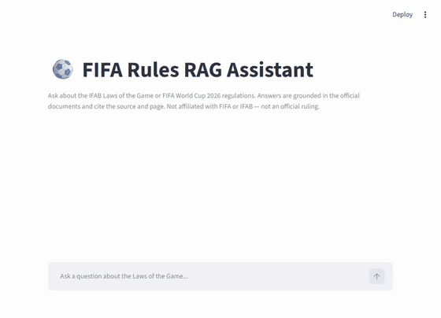
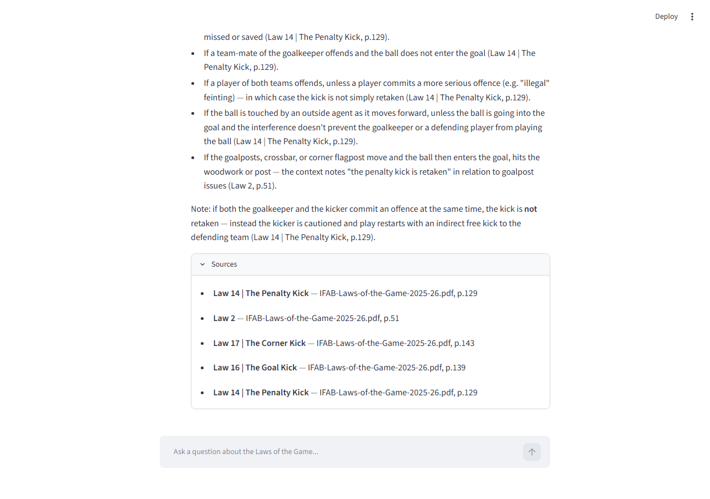
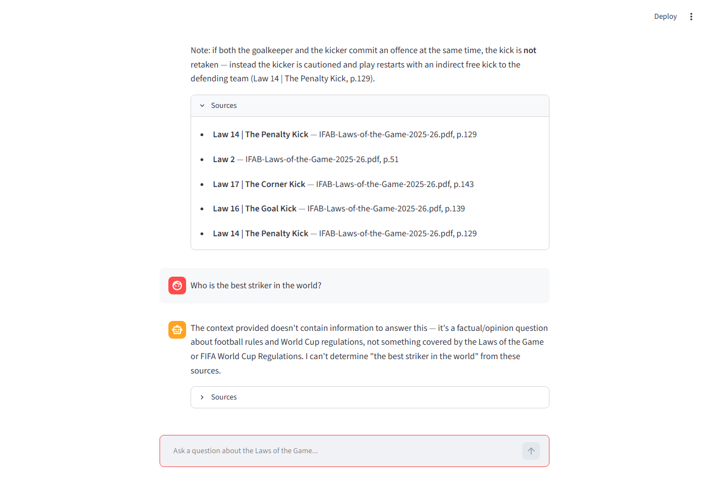
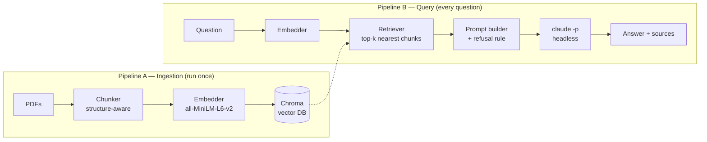

# ⚽ FIFA Rules RAG Assistant

> Ask a plain-English football rules question, get an answer grounded in the
> official IFAB Laws of the Game and FIFA World Cup regulations — cited by
> law and page, or an honest "I don't know" when the documents don't cover it.

Football's official rulebooks — the IFAB Laws of the Game (~230 pages) and
the FIFA World Cup regulations — contain the definitive answer to almost
every rules argument fans and commentators have. But nobody reads them,
because finding one specific answer means scrolling through hundreds of
pages of dense legal-style text. This project builds a Retrieval-Augmented
Generation (RAG) assistant that answers questions using *only* those
documents, and says so honestly when it doesn't know.

## Demo



Two things happening in the recording above: a rules question gets a
grounded answer citing the exact Law and page, then an out-of-scope
question ("Who is the best striker in the world?") gets an honest refusal
instead of a guess — the whole point of building this over a plain chatbot.

**Sample exchange (text):**

> **Q: How many substitutions are allowed in the 2026 World Cup?**
>
> At the 2026 FIFA World Cup, each team may use a maximum of **five
> substitutes**, with a maximum of **three substitution opportunities**
> (simultaneous substitutions by both teams count as one used opportunity
> each); substitutions at half-time don't count as an opportunity. Teams
> may also make **one additional permanent concussion substitute** per
> match, separate from the normal limit.
>
> — *Article 36.2 & 36.3, FIFA World Cup 2026 Regulations, p.55*

**Detail views (static):**

**A grounded, cited answer:**



**Honest refusal on an out-of-scope question:**



## Why RAG (and not just asking ChatGPT/Claude directly)?

- **A plain LLM answers from training memory.** It may be outdated (rules
  change every season), can't cite where an answer came from, and will
  confidently guess when unsure.
- **A RAG system answers from *these* documents.** The model is only
  allowed to use text retrieved from the official PDFs, which gives three
  properties a plain chatbot can't offer:
  1. **Groundedness** — answers come from the actual current rulebook, not memory.
  2. **Citability** — every answer points to a source document and page.
  3. **Honest refusal** — if the documents don't contain the answer, the system says so.
- **Updatable for free.** When IFAB publishes next season's Laws, drop in
  the new PDF and re-run ingestion. No retraining, no code changes.

## Architecture

Two pipelines that share one vector database:



| File | Role |
|---|---|
| `src/ingest.py` | Load PDFs → structure-aware chunk → embed → store in Chroma |
| `src/retrieve.py` | Question → top-k relevant chunks from Chroma |
| `src/llm.py` | Wraps the `claude -p` CLI call (prompt piped via stdin) |
| `src/app.py` | Streamlit chat UI tying retrieval + LLM together |

**328 pages across 2 documents → 423 chunks** in the vector database
(`python src/ingest.py` prints this on every run).

### A note on the chunker

Character-count chunking alone cuts a Law's numbered sub-clauses mid-thought.
`ingest.py` instead detects real document structure before falling back to
size-based splitting:

- **IFAB Laws of the Game**: each Law is preceded by a dedicated
  divider page (just the word "Law" + a number, styled as a large heading).
  A secondary, less-consistent running header (`Laws of the Game 2025/26 |
  Law 1 | The Field of Play`) is used to enrich the label with a title when
  present.
- **FIFA World Cup Regulations**: each Article is an ALL-CAPS heading
  (`ARTICLE 5: PARTICIPATING MEMBER ASSOCIATIONS`) at the start of its own
  line — detected case-sensitively so it doesn't fire on lowercase
  cross-references like *"as set out in article 5.1"*.

Within a detected section, text is merged line-by-line up to ~1000
characters (never splitting a line, so never cutting a word in half), with
~150 characters of trailing context carried forward into the next chunk.

## Tech stack (all free + Claude Pro)

- **Python 3.13**
- **pypdf** — PDF text extraction
- **sentence-transformers** (`all-MiniLM-L6-v2`) — free, local embeddings
- **Chroma** — free, local, persistent vector database
- **Streamlit** — chat UI
- **Claude Code CLI, headless (`claude -p`)** — the LLM, billed against the
  Claude Pro subscription rather than a metered API key. The prompt is
  piped via stdin (not passed as a CLI argument) to avoid Windows's
  command-line length limit and shell-quoting issues with the rulebook text.
- **Corpus** — official public PDFs: [IFAB Laws of the Game 2025/26](https://downloads.theifab.com/downloads/laws-of-the-game-2025-26-single-pages?l=en)
  (includes the VAR protocol) and the
  [FIFA World Cup 2026 Regulations](https://digitalhub.fifa.com/m/636f5c9c6f29771f/original/FWC2026_regulations_EN.pdf)

## Setup

```bash
python -m venv venv
.\venv\Scripts\Activate.ps1        # Windows PowerShell
pip install -r requirements.txt
```

Download the two PDFs above into `data/pdfs/`, then:

```bash
python src/ingest.py               # build the vector database (run once)
streamlit run src/app.py           # start the app
```

`claude -p` uses your existing Claude Code / Claude Pro login — no API key
needed.

## Usage

Ask questions like:

- "When exactly is a penalty kick retaken?"
- "What counts as a handball offence under the current Laws?"
- "When is VAR allowed to intervene in a match?"
- "How many substitutions are allowed in the 2026 World Cup?"

Each answer cites its source document, page, and Law/Article. Ask something
outside the corpus (*"Who is the best striker in the world?"*) and it
declines instead of guessing — that refusal is the feature, not a bug.

## Known limitations

- **Local-only demo**: Claude auth is tied to the logged-in machine's
  subscription, so there's no public live URL — clone and run locally.
- **Retrieval misses**: purely semantic search can miss answers phrased very
  differently from the question; hybrid (semantic + keyword) search is a
  known upgrade path.
- **PDF extraction noise**: diagram captions and multi-column layouts
  occasionally produce a mislabeled or low-value chunk (e.g. one offside
  diagram's caption page gets picked up as a stray one-page "section").
- **Single-turn**: no conversation memory in v1 — each question stands alone.
- **Not affiliated with FIFA/IFAB**: an educational project over public
  documents; answers are not official rulings.

## Future extensions

- Hybrid retrieval (semantic + keyword) for better recall
- Conversation memory for follow-up questions
- Swap the corpus to prove domain-agnosticism (same code, IT/HR/legal docs)
- Observability layer: log every query, retrieved chunks, latency, token usage
- Evaluation set: a fixed batch of questions with known answers, scored automatically after each change

## License

The code in this repository is MIT licensed — see [LICENSE](LICENSE). This
does not extend to the IFAB/FIFA PDF documents themselves, which remain the
copyright of their respective publishers and are not included in this repo
(see Setup for download links).
